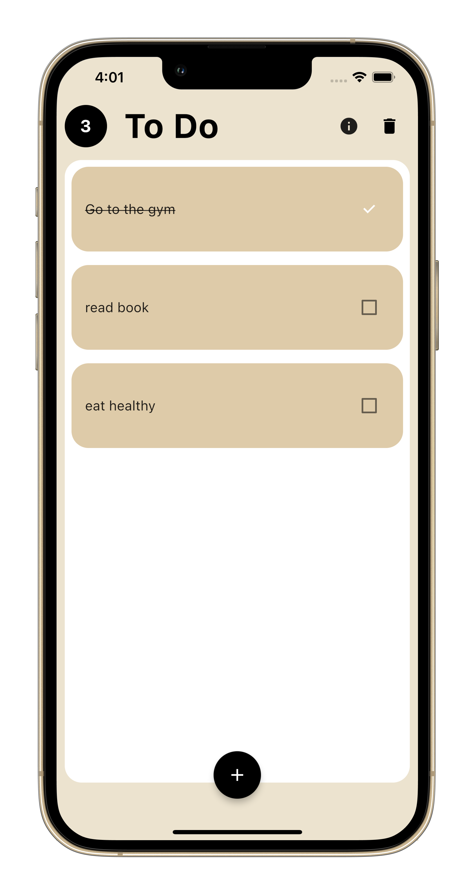

# Flutter_Projects

# Weather App
In this app I Implemented, Provider, Fetching User Location, Networking, SpinKit, Alert dilog, Permission Handler, [Check project files here](https://github.com/omr1k/Flutter_Projects/tree/main/weather_app)

# To Do App
In this app I Implemented, Provider, Hive DB, ModalBottomSheet, Alert dilog, [Check project files here](https://github.com/omr1k/Flutter_Projects/tree/main/todo_app)

