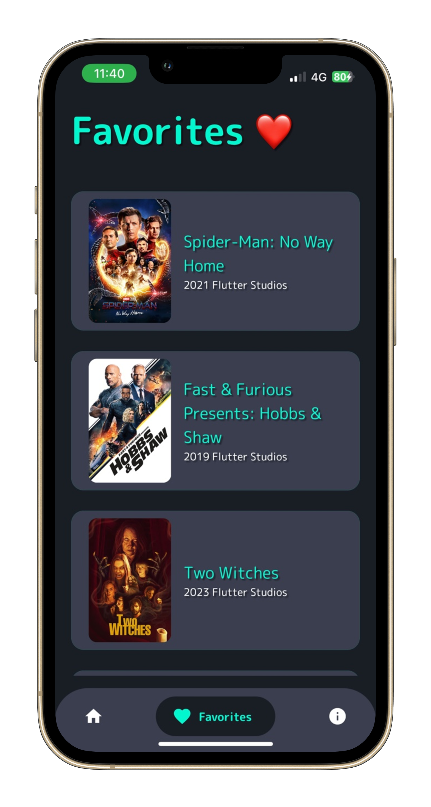
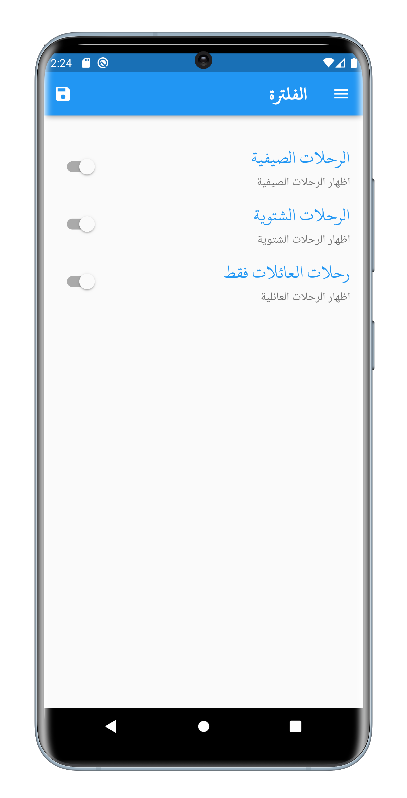
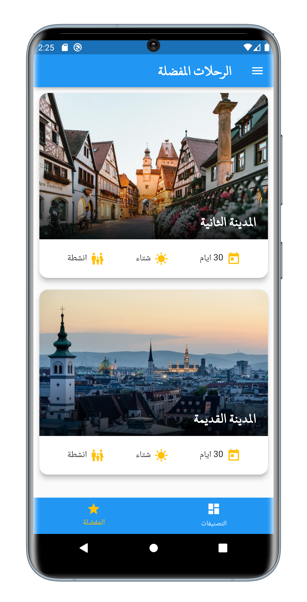

# Flutter Projects

# Film Fusion
In this app I Implemented, Provider, fetching data form API, SpinKit, Alert dilog cached network image, smooth page indicator, youtube player, google navbar, url launcher, api used is https://api.themoviedb.org 
[Check project files here](https://github.com/omr1k/Flutter_Projects/tree/main/film_fusion)

# Weather App
In this app I Implemented, Provider, Fetching User Location, Networking, SpinKit, Alert dilog, Permission Handler, [Check project files here](https://github.com/omr1k/Flutter_Projects/tree/main/weather_app)

# To Do App
In this app I Implemented, Provider, Hive DB, ModalBottomSheet, Alert dilog, [Check project files here](https://github.com/omr1k/Flutter_Projects/tree/main/todo_app)

# Simple Travelling Guide App
Simple Travelling Guide App with mock data, [Check project files here](https://github.com/omr1k/Flutter_Projects/tree/main/travel_app)

# Simple Store App
Simple Store App with mock data, [Check project files here](https://github.com/omr1k/Flutter_Projects/tree/main/simple_store_app)

